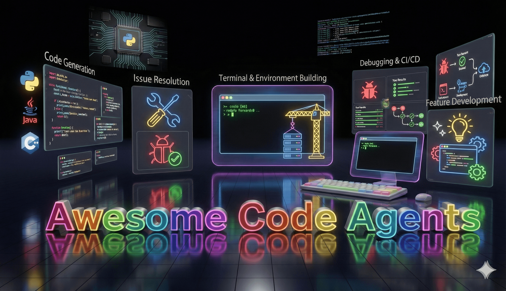
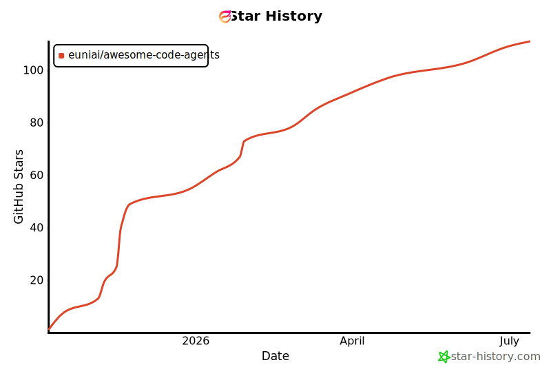

# Awesome Code Agents

### The Digital World We Are Building. The Real World We Are Acting In.

*A curated, ever-growing collection of frontier research papers and technical reports on autonomous code agents.*

 

 

*Photo Credit: [Gemini-Nano-Banana-Pro🍌](https://deepmind.google/models/gemini-image/pro/)*.

<!-- Optional teaser -->
<!--

  

-->
<!-- 

  A curated list of <b>frontier research papers and technical reports</b> on <b>Code Agents</b>.

 -->

---

## Quick Navigation

<!-- START PAPERS SUMMARY -->
🔥 **We are actively tracking the frontier research of code agents.** 
🧹 *The list below shows the last twelve months; the [full paper list](automation/PAPERS.md) holds the complete collection.* 
📚 *Currently collected:* **`470` papers.** *(Last update: 2026-07-12)*
<!-- END PAPERS SUMMARY -->

<!-- NAV:BEGIN -->
- [🧠 Foundation Models](#-foundation-models)
- [📊 Surveys & Empirical Studies](#-surveys--empirical-studies)
- [🧱 Code as Artifact: Building the Digital World](#-code-as-artifact-building-the-digital-world)
  * [💻 General Software](#-general-software)
    + [🐛 Debugging & Issue Resolution](#-debugging--issue-resolution)
    + [✏️ Code Generation & Completion](#-code-generation--completion)
    + [🛠️ Environment Setup & CI/CD](#-environment-setup--cicd)
    + [🔄 Maintenance & Evolution](#-maintenance--evolution)
    + [🔍 Code Review](#-code-review)
    + [🔒 Security](#-security)
    + [📖 Comprehension & Documentation](#-comprehension--documentation)
    + [🧪 Testing & Verification](#-testing--verification)
    + [🏗️ Feature Development](#-feature-development)
  * [🧊 3D & CAD](#-3d--cad)
  * [🌐 Web Applications](#-web-applications)
  * [🗄️ Databases](#-databases)
  * [🎨 Graphics & Animation](#-graphics--animation)
  * [⚙️ Systems](#-systems)
  * [🎮 Games](#-games)
  * [🔌 Hardware](#-hardware)
- [🌍 Code as Agency: Acting in the Real World](#-code-as-agency-acting-in-the-real-world)
  * [🔬 Research & Discovery](#-research--discovery)
  * [🖥️ Terminals & Operating Systems](#-terminals--operating-systems)
  * [🤖 The Physical World](#-the-physical-world)
  * [🕹️ Game Worlds](#-game-worlds)
  * [🧭 Browsers & the Web](#-browsers--the-web)
  * [🧰 Software Applications](#-software-applications)
<!-- NAV:END -->
- [🗺️ Research Landscape](#-research-landscape)
- [🤝 Contributing](#-contributing)
- [🌟 Star History](#-star-history)
- [🙏 Acknowledgements](#-acknowledgements)

---

<!-- PAPERS:BEGIN -->
## 🧠 Foundation Models

> Flagship frontier models that both write code and act through it.

- **LoopCoder-v2: Only Loop Once for Efficient Test-Time Computation Scaling.**  
  _Jian Yang, Shawn Guo, Wei Zhang, Tianyu Zheng, Yaxin Du, Haau-Sing Li, Jiajun Wu, Yue Song, Yan Xing, Qingsong Cai, et al._ arXiv 2026/06.  
   

- **KAT-Coder Technical Report.**  
  _Zizheng Zhan, Ken Deng, Jinghui Wang, Xiaojiang Zhang, Huaixi Tang, Minglei Zhang, Zhiyi Lai, Haoyang Huang, Wen Xiang, Kun Wu, et al._ arXiv 2025/10.  
   

- **Kimi K2: Open Agentic Intelligence.**  
  _Kimi Team: Yifan Bai, Yiping Bao, Guanduo Chen, Jiahao Chen, Ningxin Chen, Ruijue Chen, Yanru Chen, Yuankun Chen, Yutian Chen, Zhuofu Chen, et al._ arXiv 2025/07.  
   

… plus 1 earlier paper(s): see the [full list](automation/PAPERS.md#-foundation-models).

## 📊 Surveys & Empirical Studies

> Research that studies and surveys code agents themselves.

- **3100 Opinions on Code Review in an AI World: Building Causal Theory from Practitioner Discourse.**  
  _Shyam Agarwal, Courtney Miller, Christian Kästner, Bogdan Vasilescu._ arXiv 2026/07.  
   

- **From Solvers to Research: Large Language Model-Driven Formal Mathematics at the Research Frontier.**  
  _Eric Jiang, Xiao Liang, Yikai Zhang, Yingjia Wan, Mengting Li, Haikang Deng, Alexander K. Taylor, Justin Baker, Rushil Raghavan, Junyi Zhang, et al._ arXiv 2026/07.  
   

- **How Coding Agents Fail Their Users: A Large-Scale Analysis of Developer-Agent Misalignment in 20,574 Real-World Sessions.**  
  _Ningzhi Tang, Chaoran Chen, Gelei Xu, Yiyu Shi, Yu Huang, Collin McMillan, Tao Dong, Toby Jia-Jun Li._ arXiv 2026/05.  
   

- **TrajAudit: Automated Failure Diagnosis for Agentic Coding Systems.**  
  _Minxing Wang, Xiaofei Xie, Yintong Huo._ arXiv 2026/05.  
   

- **SpecBench: Measuring Reward Hacking in Long-Horizon Coding Agents.**  
  _Bingchen Zhao, Dhruv Srikanth, Yuxiang Wu, Zhengyao Jiang._ arXiv 2026/05.  
   

- **Overeager Coding Agents: Measuring Out-of-Scope Actions on Benign Tasks.**  
  _Yubin Qu, Ying Zhang, Yanjun Zhang, Gelei Deng, Yuekang Li, Leo Yu Zhang, Yi Liu._ arXiv 2026/05.  
    

- **Code as Agent Harness.**  
  _Xuying Ning, Katherine Tieu, Dongqi Fu, Tianxin Wei, Zihao Li, Yuanchen Bei, Jiaru Zou, Mengting Ai, Zhining Liu, Ting-Wei Li, et al._ arXiv 2026/05.  
   

- **SWE-chat: Coding Agent Interactions From Real Users in the Wild.**  
  _Joachim Baumann, Vishakh Padmakumar, Xiang Li, John Yang, Diyi Yang, Sanmi Koyejo._ arXiv 2026/04.  
    

- **Dive into Claude Code: The Design Space of Today's and Future AI Agent Systems.**  
  _Jiacheng Liu, Xiaohan Zhao, Xinyi Shang, Zhiqiang Shen._ arXiv 2026/04.  
   

- **CodeTracer: Towards Traceable Agent States.**  
  _Han Li, Yifan Yao, Letian Zhu, Rili Feng, Hongyi Ye, Jiaming Wang, Yancheng He, Pengyu Zou, Lehan Zhang, Xinping Lei, et al._ arXiv 2026/04.  
   

- **Programming by Chat: A Large-Scale Behavioral Analysis of 11,579 Real-World AI-Assisted IDE Sessions.**  
  _Ningzhi Tang, Chaoran Chen, Zihan Fang, Gelei Xu, Maria Dhakal, Yiyu Shi, Collin McMillan, Yu Huang, Toby Jia-Jun Li._ arXiv 2026/04.  
   

- **How Do Developers Interact with AI? An Exploratory Study on Modeling Developer Programming Behavior.**  
  _Yinan Wu, Ze Shi Li, Kathryn Thomasset Stolee, Bowen Xu._ arXiv 2026/03.  
   

- **SWE-Skills-Bench: Do Agent Skills Actually Help in Real-World Software Engineering?**  
  _Tingxu Han, Yi Zhang, Wei Song, Chunrong Fang, Zhenyu Chen, Youcheng Sun, Lijie Hu._ arXiv 2026/03.  
    

- **Fingerprinting AI Coding Agents on GitHub.**  
  _Taher A. Ghaleb._ arXiv 2026/01.  
   

- **Agent READMEs: An Empirical Study of Context Files for Agentic Coding.**  
  _Worawalan Chatlatanagulchai, Hao Li, Yutaro Kashiwa, Brittany Reid, Kundjanasith Thonglek, Pattara Leelaprute, Arnon Rungsawang, Bundit Manaskasemsak, Bram Adams, Ahmed E. Hassan, et al._ arXiv 2025/11.  
   

- **Does AI-Assisted Coding Deliver? A Difference-in-Differences Study of Cursor's Impact on Software Projects.**  
  _Hao He, Courtney Miller, Shyam Agarwal, Christian Kästner, Bogdan Vasilescu._ arXiv 2025/11.  
   

- **A Comprehensive Empirical Evaluation of Agent Frameworks on Code-centric Software Engineering Tasks.**  
  _Zhuowen Yin, Cuifeng Gao, Chunsong Fan, Wenzhang Yang, Yinxing Xue, Lijun Zhang._ arXiv 2025/11.  
   

- **A Survey of Vibe Coding with Large Language Models.**  
  _Yuyao Ge, Lingrui Mei, Zenghao Duan, Tianhao Li, Yujia Zheng, Yiwei Wang, Lexin Wang, Jiayu Yao, Tianyu Liu, Yujun Cai, et al._ arXiv 2025/10.  
    

- **How can we assess human-agent interactions? Case studies in software agent design.**  
  _Valerie Chen, Rohit Malhotra, Xingyao Wang, Juan Michelini, Xuhui Zhou, Aditya Bharat Soni, Hoang H. Tran, Calvin Smith, Ameet Talwalkar, Graham Neubig._ arXiv 2025/10.  
   

- **A Comprehensive Survey on Benchmarks and Solutions in Software Engineering of LLM-Empowered Agentic System.**  
  _Jiale Guo, Suizhi Huang, Mei Li, Dong Huang, Xingsheng Chen, Regina Zhang, Zhijiang Guo, Han Yu, Siu-Ming Yiu, Christian Jensen, et al._ arXiv 2025/10.  
    

- **On the Use of Agentic Coding: An Empirical Study of Pull Requests on GitHub.**  
  _Miku Watanabe, Hao Li, Yutaro Kashiwa, Brittany Reid, Hajimu Iida, Ahmed E. Hassan._ arXiv 2025/09.  
   

- **Agentic Software Engineering: Foundational Pillars and a Research Roadmap.**  
  _Ahmed E. Hassan, Hao Li, Dayi Lin, Bram Adams, Tse-Hsun Chen, Yutaro Kashiwa, Dong Qiu._ arXiv 2025/09.  
   

- **"My productivity is boosted, but ..." Demystifying Users' Perception on AI Coding Assistants.**  
  _Yunbo Lyu, Zhou Yang, Jieke Shi, Jianming Chang, Yue Liu, David Lo._ ASE 2025.  
   

- **A Survey on Code Generation with LLM-based Agents.**  
  _Yihong Dong, Xue Jiang, Jiaru Qian, Tian Wang, Kechi Zhang, Zhi Jin, Ge Li._ arXiv 2025/07.  
    

- **The Rise of AI Teammates in Software Engineering (SE) 3.0: How Autonomous Coding Agents Are Reshaping Software Engineering.**  
  _Hao Li, Haoxiang Zhang, Ahmed E. Hassan._ arXiv 2025/07.  
     

- **Measuring the Impact of Early-2025 AI on Experienced Open-Source Developer Productivity.**  
  _Joel Becker, Nate Rush, Elizabeth Barnes, David Rein._ arXiv 2025/07.  
   

… plus 9 earlier paper(s): see the [full list](automation/PAPERS.md#-surveys--empirical-studies).

## 🧱 Code as Artifact: Building the Digital World

> Agents that build software, from one function to an entire system.

### 💻 General Software

> Writing and maintaining general-purpose software.

#### 🐛 Debugging & Issue Resolution

> Reproducing, locating, and fixing reported bugs.

- **AgentLens: Production-Assessed Trajectory Reviews for Coding Agent Evaluation.**  
  _Andrey Podivilov, Vadim Lomshakov, Sergey Savin, Matvei Startsev, Roman Pozharskiy, Maksim Parshin, Sergey Nikolenko._ arXiv 2026/07.  
     

- **Dockerless: Environment-Free Program Verifier for Coding Agents.**  
  _Wenhao Zeng, Yuling Shi, Xiaodong Gu, Chao Hu, Chaofan Wang, Yuhao Cui, Hongting Zhou, Mengnan Qi, Jianqiao Wangni, Zhaojian Yu, et al._ arXiv 2026/06.  
   

- **FastContext: Training Efficient Repository Explorer for Coding Agents.**  
  _Shaoqiu Zhang, Maoquan Wang, Yuling Shi, Yuhang Wang, Xiaodong Gu, Yongqiang Yao, Tori Gong, Sheng Chen, Rao Fu, Anisha Agarwal, et al._ arXiv 2026/06.  
   

- **Claw-SWE-Bench: A Benchmark for Evaluating OpenClaw-style Agent Harnesses on Coding Tasks.**  
  _Mengyu Zheng, Kai Han, Boxun Li, Haiyang Xu, Yuchuan Tian, Wei He, Hang Zhou, Jianyuan Guo, Hailin Hu, Lin Ma, et al._ arXiv 2026/06.  
   

- **SWE-Explore: Benchmarking How Coding Agents Explore Repositories.**  
  _Shaoqiu Zhang, Yuhang Wang, Jialiang Liang, Yuling Shi, Wenhao Zeng, Maoquan Wang, Shilin He, Ningyuan Xu, Siyu Ye, Kai Cai, et al._ arXiv 2026/06.  
   

- **CODESKILL: Learning Self-Evolving Skills for Coding Agents.**  
  _Yanzhou Li, Yiran Zhang, Xiaoyu Zhang, Xiaoxia Liu, Yang Liu._ arXiv 2026/05.  
  

- **AgentLens: Revealing The Lucky Pass Problem in SWE-Agent Evaluation.**  
  _Priyam Sahoo, Gaurav Mittal, Xiaomin Li, Shengjie Ma, Benjamin Steenhoek, Pingping Lin, Yu Hu._ arXiv 2026/05.  
   

- **TACT: Mitigating Overthinking and Overacting in Coding Agents via Activation Steering.**  
  _Yuan Sui, Yulin Chen, Yibo Li, Xue Jiang, Yufei He, Yihong Dong, Xiaoxin He, Tianyu Gao, Bryan Hooi._ arXiv 2026/05.  
  

- **Empowering Autonomous Debugging Agents with Efficient Dynamic Analysis.**  
  _Jiahong Xiang, Xiaoyang Xu, Xiaopan Chu, Hongliang Tian, Yuqun Zhang._ arXiv 2026/04.  
  

- **Asking What Matters: Reward-Driven Clarification for Software Engineering Tasks.**  
  _Sanidhya Vijayvargiya, Vijay Viswanathan, Graham Neubig._ arXiv 2026/04.  
   

- **Scaling Test-Time Compute for Agentic Coding.**  
  _Joongwon Kim, Wannan Yang, Kelvin Niu, Hongming Zhang, Yun Zhu, Eryk Helenowski, Ruan Silva, Zhengxing Chen, Srinivasan Iyer, Manzil Zaheer, et al._ arXiv 2026/04.  
  

- **How and Why Agents Can Identify Bug-Introducing Commits.**  
  _Niklas Risse, Marcel Böhme._ arXiv 2026/03.  
   

- **Coherence Collapse: Diagnosing Why Code Agents Fail After Reaching the Right Code.**  
  _Myeongsoo Kim, Dingmin Wang, Siwei Cui, Farima Farmahinifarahani, Terry Yue Zhuo, Shweta Garg, Baishakhi Ray, Rajdeep Mukherjee, Varun Kumar._ arXiv 2026/03.  
   

- **SWE-Next: Scalable Real-World Software Engineering Tasks for Agents.**  
  _Jiarong Liang, Zhiheng Lyu, Zijie Liu, Xiangchao Chen, Ping Nie, Kai Zou, Wenhu Chen._ arXiv 2026/03.  
   

- **daVinci-Env: Open SWE Environment Synthesis at Scale.**  
  _Dayuan Fu, Shenyu Wu, Yunze Wu, Zerui Peng, Yaxing Huang, Jie Sun, Ji Zeng, Mohan Jiang, Lin Zhang, Yukun Li, et al._ arXiv 2026/03.  
    

- **BeyondSWE: Can Current Code Agent Survive Beyond Single-Repo Bug Fixing?**  
  _Guoxin Chen, Fanzhe Meng, Jiale Zhao, Minghao Li, Daixuan Cheng, Huatong Song, Jie Chen, Yuzhi Lin, Hui Chen, Xin Zhao, et al._ arXiv 2026/03.  
   

- **SWE-ABS: Adversarial Benchmark Strengthening Exposes Inflated Success Rates on Test-based Benchmark.**  
  _Boxi Yu, Yang Cao, Yuzhong Zhang, Liting Lin, Junjielong Xu, Zhiqing Zhong, Qinghua Xu, Guancheng Wang, Jialun Cao, Shing-Chi Cheung, et al._ arXiv 2026/02.  
   

- **SWE-rebench V2: Language-Agnostic SWE Task Collection at Scale.**  
  _Ibragim Badertdinov, Maksim Nekrashevich, Anton Shevtsov, Alexander Golubev._ arXiv 2026/02.  
    

- **SWE-MiniSandbox: Container-Free Reinforcement Learning for Building Software Engineering Agents.**  
  _Danlong Yuan, Wei Wu, Enhan Zhao, Zhengren Wang, Xueliang Zhao, Huishuai Zhang, Dongyan Zhao._ arXiv 2026/02.  
  

- **Immersion in the GitHub Universe: Scaling Coding Agents to Mastery.**  
  _Jiale Zhao, Guoxin Chen, Fanzhe Meng, Minghao Li, Jie Chen, Hui Xu, Yongshuai Sun, Wayne Xin Zhao, Ruihua Song, Yuan Zhang, et al._ arXiv 2026/02.  
   

- **Rethinking the Value of Agent-Generated Tests for LLM-Based Software Engineering Agents.**  
  _Zhi Chen, Zhensu Sun, Yuling Shi, Chao Peng, Xiaodong Gu, David Lo, Lingxiao Jiang._ arXiv 2026/02.  
   

- **SWE-Universe: Scale Real-World Verifiable Environments to Millions.**  
  _Mouxiang Chen, Lei Zhang, Yunlong Feng, Xuwu Wang, Wenting Zhao, Ruisheng Cao, Jiaxi Yang, Jiawei Chen, Mingze Li, Zeyao Ma, et al._ arXiv 2026/02.  
   

- **Closing the Loop: Universal Repository Representation with RPG-Encoder.**  
  _Jane Luo, Chengyu Yin, Xin Zhang, Qingtao Li, Steven Liu, Yiming Huang, Jie Wu, Hao Liu, Yangyu Huang, Yu Kang, et al._ arXiv 2026/02.  
  

- **SWE-Lego: Pushing the Limits of Supervised Fine-tuning for Software Issue Resolving.**  
  _Chaofan Tao, Jierun Chen, Yuxin Jiang, Kaiqi Kou, Shaowei Wang, Ruoyu Wang, Xiaohui Li, Sidi Yang, Yiming Du, Jianbo Dai, et al._ arXiv 2026/01.  
     

- **Toward Training Superintelligent Software Agents through Self-Play SWE-RL.**  
  _Yuxiang Wei, Zhiqing Sun, Emily McMilin, Jonas Gehring, David Zhang, Gabriel Synnaeve, Daniel Fried, Lingming Zhang, Sida Wang._ arXiv 2025/12.  
   

- **Confucius Code Agent: Scalable Agent Scaffolding for Real-World Codebases.**  
  _Zhaodong Wang, Zhenting Qi, Sherman Wong, Nathan Hu, Samuel Lin, Jun Ge, Erwin Gao, Wenlin Chen, Yilun Du, Minlan Yu, et al._ arXiv 2025/12.  
  

- **InfCode: Adversarial Iterative Refinement of Tests and Patches for Reliable Software Issue Resolution.**  
  _KeFan Li, Mengfei Wang, Hengzhi Zhang, Zhichao Li, Yuan Yuan, Mu Li, Xiang Gao, Hailong Sun, Chunming Hu, Weifeng Lv._ arXiv 2025/11.  
  

- **Live-SWE-agent: Can Software Engineering Agents Self-Evolve on the Fly?**  
  _Chunqiu Steven Xia, Zhe Wang, Yan Yang, Yuxiang Wei, Lingming Zhang._ arXiv 2025/11.  
   

- **SWE-Compass: Towards Unified Evaluation of Agentic Coding Abilities for Large Language Models.**  
  _Jingxuan Xu, Ken Deng, Weihao Li, Songwei Yu, Huaixi Tang, Haoyang Huang, Zhiyi Lai, Zizheng Zhan, Yanan Wu, Chenchen Zhang, et al._ arXiv 2025/11.  
   

- **The OpenHands Software Agent SDK: A Composable and Extensible Foundation for Production Agents.**  
  _Xingyao Wang, Simon Rosenberg, Juan Michelini, Calvin Smith, Hoang Tran, Engel Nyst, Rohit Malhotra, Xuhui Zhou, Valerie Chen, Robert Brennan, et al._ arXiv 2025/11.  
   

- **SWE-Sharp-Bench: A Reproducible Benchmark for C# Software Engineering Tasks.**  
  _Sanket Mhatre, Yasharth Bajpai, Sumit Gulwani, Emerson Murphy-Hill, Gustavo Soares._ arXiv 2025/11.  
    

- **HAFixAgent: History-Aware Automated Program Repair Agent.**  
  _Yu Shi, Hao Li, Bram Adams, Ahmed E. Hassan._ arXiv 2025/11.  
  

- **Understanding Code Agent Behaviour: An Empirical Study of Success and Failure Trajectories.**  
  _Oorja Majgaonkar, Zhiwei Fei, Xiang Li, Federica Sarro, He Ye._ arXiv 2025/10.  
   

- **TDFlow: Agentic Workflows for Test Driven Software Engineering.**  
  _Kevin Han, Siddharth Maddikayala, Tim Knappe, Om Patel, Austen Liao, Amir Barati Farimani._ arXiv 2025/10.  
  

- **BugPilot: Complex Bug Generation for Efficient Learning of SWE Skills.**  
  _Atharv Sonwane, Isadora White, Hyunji Lee, Matheus Pereira, Lucas Caccia, Minseon Kim, Zhengyan Shi, Chinmay Singh, Alessandro Sordoni, Marc-Alexandre Côté, et al._ arXiv 2025/10.  
   

- **When Old Meets New: Evaluating the Impact of Regression Tests on SWE Issue Resolution.**  
  _Yang Chen, Toufique Ahmed, Reyhaneh Jabbarvand, Martin Hirzel._ arXiv 2025/10.  
  

- **More with Less: An Empirical Study of Turn-Control Strategies for Efficient Coding Agents.**  
  _Pengfei Gao, Chao Peng._ arXiv 2025/10.  
   

- **SIADAFIX: issue description response for adaptive program repair.**  
  _Xin Cao, Nan Yu._ arXiv 2025/10.  
   

- **Lingxi: Repository-Level Issue Resolution Framework Enhanced by Procedural Knowledge Guided Scaling.**  
  _Xu Yang, Jiayuan Zhou, Michael Pacheco, Wenhan Zhu, Pengfei He, Shaowei Wang, Kui Liu, Ruiqi Pan._ arXiv 2025/10.  
   

- **Saving SWE-Bench: A Benchmark Mutation Approach for Realistic Agent Evaluation.**  
  _Spandan Garg, Ben Steenhoek, Yufan Huang._ arXiv 2025/10.  
   

- **REFINE: Enhancing Program Repair Agents through Context-Aware Patch Refinement.**  
  _Anvith Pabba, Simin Chen, Alex Mathai, Anindya Chakraborty, Baishakhi Ray._ arXiv 2025/10.  
  

- **Abstain and Validate: A Dual-LLM Policy for Reducing Noise in Agentic Program Repair.**  
  _José Cambronero, Michele Tufano, Sherry Shi, Renyao Wei, Grant Uy, Runxiang Cheng, Chin-Jung Liu, Shiying Pan, Satish Chandra, Pat Rondon._ arXiv 2025/10.  
  

- **Improving Code Localization with Repository Memory.**  
  _Boshi Wang, Weijian Xu, Yunsheng Li, Mei Gao, Yujia Xie, Huan Sun, Dongdong Chen._ arXiv 2025/10.  
  

- **ReasoningBank: Scaling Agent Self-Evolving with Reasoning Memory.**  
  _Siru Ouyang, Jun Yan, I-Hung Hsu, Yanfei Chen, Ke Jiang, Zifeng Wang, Rujun Han, Long T. Le, Samira Daruki, Xiangru Tang, et al._ arXiv 2025/09.  
  

- **Kimi-Dev: Agentless Training as Skill Prior for SWE-Agents.**  
  _Zonghan Yang, Shengjie Wang, Kelin Fu, Wenyang He, Weimin Xiong, Yibo Liu, Yibo Miao, Bofei Gao, Yejie Wang, Yingwei Ma, et al._ arXiv 2025/09.  
    

- **A Benchmark for Localizing Code and Non-Code Issues in Software Projects.**  
  _Zejun Zhang, Jian Wang, Qingyun Yang, Yifan Pan, Yi Tang, Yi Li, Zhenchang Xing, Tian Zhang, Xuandong Li, Guoan Zhang._ arXiv 2025/09.  
   

- **Extracting Conceptual Knowledge to Locate Software Issues.**  
  _Ying Wang, Wenjun Mao, Chong Wang, Zhenhao Zhou, Yicheng Zhou, Wenyun Zhao, Yiling Lou, Xin Peng._ arXiv 2025/09.  
  

- **SWE-Bench Pro: Can AI Agents Solve Long-Horizon Software Engineering Tasks?**  
  _Xiang Deng, Jeff Da, Edwin Pan, Yannis Yiming He, Charles Ide, Kanak Garg, Niklas Lauffer, Andrew Park, Nitin Pasari, Chetan Rane, et al._ arXiv 2025/09.  
     

- **An Empirical Study on Failures in Automated Issue Solving.**  
  _Simiao Liu, Fang Liu, Liehao Li, Xin Tan, Yinghao Zhu, Xiaoli Lian, Li Zhang._ arXiv 2025/09.  
   

- **SWE-Effi: Re-Evaluating Software AI Agent System Effectiveness Under Resource Constraints.**  
  _Zhiyu Fan, Kirill Vasilevski, Dayi Lin, Boyuan Chen, Yihao Chen, Zhiqing Zhong, Jie M. Zhang, Pinjia He, Ahmed E. Hassan._ arXiv 2025/09.  
    

- **SWE-Mirror: Scaling Issue-Resolving Datasets by Mirroring Issues Across Repositories.**  
  _Junhao Wang, Daoguang Zan, Shulin Xin, Siyao Liu, Yurong Wu, Kai Shen._ arXiv 2025/09.  
   

- **Automated Generation of Issue-Reproducing Tests by Combining LLMs and Search-Based Testing.**  
  _Konstantinos Kitsios, Marco Castelluccio, Alberto Bacchelli._ ASE 2025.  
   

- **Execution-Feedback Driven Test Generation from SWE Issues.**  
  _Toufique Ahmed, Jatin Ganhotra, Avraham Shinnar, Martin Hirzel._ arXiv 2025/08.  
  

- **Tool-integrated Reinforcement Learning for Repo Deep Search.**  
  _Zexiong Ma, Chao Peng, Qunhong Zeng, Pengfei Gao, Yanzhen Zou, Bing Xie._ arXiv 2025/08.  
   

- **Training Long-Context, Multi-Turn Software Engineering Agents with Reinforcement Learning.**  
  _Alexander Golubev, Maria Trofimova, Sergei Polezhaev, Ibragim Badertdinov, Maksim Nekrashevich, Anton Shevtsov, Simon Karasik, Sergey Abramov, Andrei Andriushchenko, Filipp Fisin, et al._ arXiv 2025/08.  
  

- **SE-Agent: Self-Evolution Trajectory Optimization in Multi-Step Reasoning with LLM-Based Agents.**  
  _Jiaye Lin, Yifu Guo, Yuzhen Han, Sen Hu, Ziyi Ni, Licheng Wang, Mingguang Chen, Hongzhang Liu, Ronghao Chen, Yangfan He, et al._ NeurIPS 2025.  
    

- **RepoForge: Training a SOTA Fast-thinking SWE Agent with an End-to-End Data Curation Pipeline Synergizing SFT and RL at Scale.**  
  _Zhilong Chen, Chengzong Zhao, Boyuan Chen, Dayi Lin, Yihao Chen, Arthur Leung, Gopi Krishnan Rajbahadur, Gustavo Oliva, Haoxiang Zhang, Aadi Bhatia, et al._ arXiv 2025/08.  
     

- **Leveraging Large Language Model for Information Retrieval-based Bug Localization.**  
  _Moumita Asad, Rafed Muhammad Yasir, Sam Malek._ arXiv 2025/08.  
  

- **Trae Agent: An LLM-based Agent for Software Engineering with Test-time Scaling.**  
  _Trae Research Team: Pengfei Gao, Zhao Tian, Xiangxin Meng, Xinchen Wang, Ruida Hu, Yuanan Xiao, Yizhou Liu, Zhao Zhang, Junjie Chen, Cuiyun Gao, et al._ arXiv 2025/07.  
    

- **SWE-Exp: Experience-Driven Software Issue Resolution.**  
  _Silin Chen, Shaoxin Lin, Xiaodong Gu, Yuling Shi, Heng Lian, Longfei Yun, Dong Chen, Weiguo Sun, Lin Cao, Qianxiang Wang._ arXiv 2025/07.  
   

- **SWE-Debate: Competitive Multi-Agent Debate for Software Issue Resolution.**  
  _Han Li, Yuling Shi, Shaoxin Lin, Xiaodong Gu, Heng Lian, Xin Wang, Yantao Jia, Tao Huang, Qianxiang Wang._ arXiv 2025/07.  
   

- **AutoCodeSherpa: Symbolic Explanations in AI Coding Agents.**  
  _Sungmin Kang, Haifeng Ruan, Abhik Roychoudhury._ arXiv 2025/07.  
  

- **Prometheus: Unified Knowledge Graphs for Issue Resolution in Multilingual Codebases.**  
  _Zimin Chen, Yue Pan, Siyu Lu, Jiayi Xu, Claire Le Goues, Martin Monperrus, He Ye._ arXiv 2025/07.  
    

- **Agentic Program Repair from Test Failures at Scale: A Neuro-symbolic approach with static analysis and test execution feedback.**  
  _Chandra Maddila, Adam Tait, Claire Chang, Daniel Cheng, Nauman Ahmad, Vijayaraghavan Murali, Marshall Roch, Arnaud Avondet, Aaron Meltzer, Victor Montalvao, et al._ TSE 2025.  
   

- **AssertFlip: Reproducing Bugs via Inversion of LLM-Generated Passing Tests.**  
  _Lara Khatib, Noble Saji Mathews, Meiyappan Nagappan._ arXiv 2025/07.  
  

- **SWE-MERA: A Dynamic Benchmark for Agenticly Evaluating Large Language Models on Software Engineering Tasks.**  
  _Pavel Adamenko, Mikhail Ivanov, Aidar Valeev, Rodion Levichev, Pavel Zadorozhny, Ivan Lopatin, Dmitry Babayev, Alena Fenogenova, Valentin Malykh._ arXiv 2025/07.  
     

- **SPICE: An Automated SWE-Bench Labeling Pipeline for Issue Clarity, Test Coverage, and Effort Estimation.**  
  _Gustavo A. Oliva, Gopi Krishnan Rajbahadur, Aaditya Bhatia, Haoxiang Zhang, Yihao Chen, Zhilong Chen, Arthur Leung, Dayi Lin, Boyuan Chen, Ahmed E. Hassan._ ASE 2025.  
   

… plus 86 earlier paper(s): see the [full list](automation/PAPERS.md#-debugging--issue-resolution).

#### ✏️ Code Generation & Completion

> Generating and completing code, from a function to a whole repository.

- **ATM: CID-Brokered Pre-Write Admission for Multi-Agent Code Co-Synthesis.**  
  _Eagl Huang._ arXiv 2026/06.  
  

- **DeNovoSWE: Scaling Long-Horizon Environments for Generating Entire Repositories from Scratch.**  
  _Jiale Zhao, Guoxin Chen, Fanzhe Meng, Wayne Xin Zhao, Ruihua Song, Ji-Rong Wen, Kai Jia._ arXiv 2026/06.  
   

- **Code2LoRA: Hypernetwork-Generated Adapters for Code Language Models under Software Evolution.**  
  _Liliana Hotsko, Yinxi Li, Yuntian Deng, Pengyu Nie._ arXiv 2026/06.  
   

- **CoRe-Code: Collaborative Reinforcement Learning for Code Generation.**  
  _Zhihao Dou, Qinjian Zhao, Zhongwei Wan, Xiaoyu Xia, Sumon Biswas._ arXiv 2026/05.  
  

- **RepoZero: Can LLMs Generate a Code Repository from Scratch?**  
  _Zhaoxi Zhang, Yiming Xu, Jiahui Liang, Weikang Li, Xiaoshuai Chen, Liwei Qian, Xin Pei, Jizhou Huang, Run Sun, Yunfang Wu._ arXiv 2026/05.  
   

- **PlayCoder: Making LLM-Generated GUI Code Playable.**  
  _Zhiyuan Peng, Wei Tao, Xin Yin, Chenhao Ying, Yuan Luo, Yiwen Guo._ arXiv 2026/04.  
   

- **Benchmarking PhD-Level Coding in 3D Geometric Computer Vision.**  
  _Wenyi Li, Renkai Luo, Yue Yu, Huan-ang Gao, Mingju Gao, Li Yuan, Chaoyou Fu, Hao Zhao._ arXiv 2026/03.  
   

- **InCoder-32B: Code Foundation Model for Industrial Scenarios.**  
  _Jian Yang, Wei Zhang, Jiajun Wu, Junhang Cheng, Shawn Guo, Haowen Wang, Weicheng Gu, Yaxin Du, Joseph Li, Fanglin Xu, et al._ arXiv 2026/03.  
   

- **SWE-AGI: Benchmarking Specification-Driven Software Construction with MoonBit in the Era of Autonomous Agents.**  
  _Zhirui Zhang, Hongbo Zhang, Haoxiang Fei, Zhiyuan Bao, Yubin Chen, Zhengyu Lei, Ziyue Liu, Yixuan Sun, Mingkun Xiao, Zihang Ye, et al._ arXiv 2026/02.  
   

- **DevBench: A Realistic, Developer-Informed Benchmark for Code Generation Models.**  
  _Adarsh Kumarappan, Pareesa Ameneh Golnari, Wen Wen, Xiaoyu Liu, Gabriel Ryan, Yuting Sun, Shengyu Fu, Elsie Nallipogu._ arXiv 2026/01.  
   

- **Smarter Together: Creating Agentic Communities of Practice through Shared Experiential Learning.**  
  _Valentin Tablan, Scott Taylor, Gabriel Hurtado, Kristoffer Bernhem, Anders Uhrenholt, Gabriele Farei, Karo Moilanen._ arXiv 2025/11.  
  

- **Towards Realistic Project-Level Code Generation via Multi-Agent Collaboration and Semantic Architecture Modeling.**  
  _Qianhui Zhao, Li Zhang, Fang Liu, Junhang Cheng, Chengru Wu, Junchen Ai, Qiaoyuanhe Meng, Lichen Zhang, Xiaoli Lian, Shubin Song, et al._ arXiv 2025/11.  
    

- **JanusCoder: Towards a Foundational Visual-Programmatic Interface for Code Intelligence.**  
  _Qiushi Sun, Jingyang Gong, Yang Liu, Qiaosheng Chen, Lei Li, Kai Chen, Qipeng Guo, Ben Kao, Fei Yuan._ arXiv 2025/10.  
     

- **SpecAgent: A Speculative Retrieval and Forecasting Agent for Code Completion.**  
  _George Ma, Anurag Koul, Qi Chen, Yawen Wu, Sachit Kuhar, Yu Yu, Aritra Sengupta, Varun Kumar, Murali Krishna Ramanathan._ arXiv 2025/10.  
   

- **Vibe Checker: Aligning Code Evaluation with Human Preference.**  
  _Ming Zhong, Xiang Zhou, Ting-Yun Chang, Qingze Wang, Nan Xu, Xiance Si, Dan Garrette, Shyam Upadhyay, Jeremiah Liu, Jiawei Han, et al._ arXiv 2025/10.  
   

- **Retrieval-Augmented Code Generation: A Survey with Focus on Repository-Level Approaches.**  
  _Yicheng Tao, Yao Qin, Yepang Liu._ arXiv 2025/10.  
   

- **CWM: An Open-Weights LLM for Research on Code Generation with World Models.**  
  _FAIR CodeGen team, Jade Copet, Quentin Carbonneaux, Gal Cohen, Jonas Gehring, Jacob Kahn, Jannik Kossen, Felix Kreuk, Emily McMilin, Michel Meyer, et al._ arXiv 2025/09.  
    

- **RPG: A Repository Planning Graph for Unified and Scalable Codebase Generation.**  
  _Jane Luo, Xin Zhang, Steven Liu, Jie Wu, Jianfeng Liu, Yiming Huang, Yangyu Huang, Chengyu Yin, Ying Xin, Yuefeng Zhan, et al._ arXiv 2025/09.  
   

- **GRACE: Graph-Guided Repository-Aware Code Completion through Hierarchical Code Fusion.**  
  _Xingliang Wang, Baoyi Wang, Chen Zhi, Junxiao Han, Xinkui Zhao, Jianwei Yin, Shuiguang Deng._ arXiv 2025/09.  
  

- **VisCodex: Unified Multimodal Code Generation via Merging Vision and Coding Models.**  
  _Lingjie Jiang, Shaohan Huang, Xun Wu, Yixia Li, Dongdong Zhang, Furu Wei._ arXiv 2025/08.  
     

- **Next Edit Prediction: Learning to Predict Code Edits from Context and Interaction History.**  
  _Ruofan Lu, Yintong Huo, Meng Zhang, Yichen Li, Michael R. Lyu._ arXiv 2025/08.  
     

- **SimdBench: Benchmarking Large Language Models for SIMD-Intrinsic Code Generation.**  
  _Yibo He, Shuoran Zhao, Jiaming Huang, Yingjie Fu, Hao Yu, Cunjian Huang, Tao Xie._ arXiv 2025/07.  
   

… plus 39 earlier paper(s): see the [full list](automation/PAPERS.md#-code-generation--completion).

#### 🛠️ Environment Setup & CI/CD

> Setting up environments, builds, CI/CD, and version control.

- **SetupX: Can LLM Agents Learn from Past Failures in Functionality-Correct Code Repository Setup?**  
  _Zihang Zhou, Ziqian Ren, Yukai Wu, Yingjie Xiong, Wei Zhou, Chao Peng, Dong Zhang, Bingheng Yan, Xuanhe Zhou, Fan Wu._ arXiv 2026/05.  
  

- **DevOps-Gym: Benchmarking AI Agents in Software DevOps Cycle.**  
  _Yuheng Tang, Kaijie Zhu, Bonan Ruan, Chuqi Zhang, Michael Yang, Hongwei Li, Suyue Guo, Tianneng Shi, Zekun Li, Christopher Kruegel, et al._ arXiv 2026/01.  
   

- **Exploring and Unleashing the Power of Large Language Models in CI/CD Configuration Translation.**  
  _Chong Wang, Chen Zhang, Jiajun Wu, Wunan Guo, Jianfeng Qu, Yewen Tian, Yang Liu._ arXiv 2025/11.  
   

- **Can Language Models Go Beyond Coding? Assessing the Capability of Language Models to Build Real-World Systems.**  
  _Chenyu Zhao, Shenglin Zhang, Zeshun Huang, Weilin Jin, Yongqian Sun, Dan Pei, Chaoyun Zhang, Qingwei Lin, Chetan Bansal, Saravan Rajmohan, et al._ arXiv 2025/11.  
   

- **Process-Level Trajectory Evaluation for Environment Configuration in Software Engineering Agents.**  
  _Jiayi Kuang, Yinghui Li, Xin Zhang, Yangning Li, Di Yin, Xing Sun, Ying Shen, Philip S. Yu._ arXiv 2025/10.  
   

… plus 12 earlier paper(s): see the [full list](automation/PAPERS.md#-environment-setup--cicd).

#### 🔄 Maintenance & Evolution

> Refactoring, migrating, and optimizing existing code.

- **SWE-CI: Evaluating Agent Capabilities in Maintaining Codebases via Continuous Integration.**  
  _Jialong Chen, Xander Xu, Hu Wei, Chuan Chen, Bing Zhao._ arXiv 2026/03.  
   

- **Controlled Self-Evolution for Algorithmic Code Optimization.**  
  _Tu Hu, Ronghao Chen, Shuo Zhang, Jianghao Yin, Mou Xiao Feng, Jingping Liu, Shaolei Zhang, Wenqi Jiang, Yuqi Fang, Sen Hu, et al._ arXiv 2026/01.  
   

- **RefAgent: A Multi-agent LLM-based Framework for Automatic Software Refactoring.**  
  _Khouloud Oueslati, Maxime Lamothe, Foutse Khomh._ arXiv 2025/11.  
  

- **What a diff makes: automating code migration with large language models.**  
  _Katherine A. Rosenfeld, Cliff C. Kerr, Jessica Lundin._ arXiv 2025/10.  
   

- **MatchFixAgent: Language-Agnostic Autonomous Repository-Level Code Translation Validation and Repair.**  
  _Ali Reza Ibrahimzada, Brandon Paulsen, Reyhaneh Jabbarvand, Joey Dodds, Daniel Kroening._ arXiv 2025/09.  
  

- **SWE-Perf: Can Language Models Optimize Code Performance on Real-World Repositories?**  
  _Xinyi He, Qian Liu, Mingzhe Du, Lin Yan, Zhijie Fan, Yiming Huang, Zejian Yuan, Zejun Ma._ arXiv 2025/07.  
     

… plus 4 earlier paper(s): see the [full list](automation/PAPERS.md#-maintenance--evolution).

#### 🔍 Code Review

> Reviewing code changes and pull requests.

- **Automating Low-Risk Code Review at Meta: RADAR, Risk Calibration, and Review Efficiency.**  
  _Chris Adams, Arjun Singh Banga, Parveen Bansal, Souvik Bhattacharya, Rujin Cao, Pedro Canahuati, Nate Cook, Brian Ellis, Prabhakar Goyal, Gurinder Grewal, et al._ arXiv 2026/05.  
   

- **Issue-Oriented Agent-Based Framework for Automated Review Comment Generation.**  
  _Shuochuan Li, Dong Wang, Patanamon Thongtanunam, Zan Wang, Jiuqiao Yu, Junjie Chen._ arXiv 2025/11.  
  

- **Benchmarking and Studying the LLM-based Code Review.**  
  _Zhengran Zeng, Ruikai Shi, Keke Han, Yixin Li, Kaicheng Sun, Yidong Wang, Zhuohao Yu, Rui Xie, Wei Ye, Shikun Zhang._ arXiv 2025/09.  
   

… plus 4 earlier paper(s): see the [full list](automation/PAPERS.md#-code-review).

#### 🔒 Security

> Detecting and fixing security vulnerabilities in code.

- **VulnLLM-R: Specialized Reasoning LLM with Agent Scaffold for Vulnerability Detection.**  
  _Yuzhou Nie, Hongwei Li, Chengquan Guo, Ruizhe Jiang, Zhun Wang, Bo Li, Dawn Song, Wenbo Guo._ arXiv 2025/12.  
   

- **Is Vibe Coding Safe? Benchmarking Vulnerability of Agent-Generated Code in Real-World Tasks.**  
  _Songwen Zhao, Danqing Wang, Kexun Zhang, Jiaxuan Luo, Zhuo Li, Lei Li._ arXiv 2025/12.  
    

- **When “Correct” Is Not Safe: Can We Trust Functionally Correct Patches Generated by Code Agents?**  
  _Yibo Peng, James Song, Lei Li, Xinyu Yang, Mihai Christodorescu, Ravi Mangal, Corina Pasareanu, Haizhong Zheng, Beidi Chen._ arXiv 2025/10.  
    

- **From Trace to Line: LLM Agent for Real-World OSS Vulnerability Localization.**  
  _Haoran Xi, Minghao Shao, Brendan Dolan-Gavitt, Muhammad Shafique, Ramesh Karri._ arXiv 2025/09.  
   

- **SecureAgentBench: Benchmarking Secure Code Generation under Realistic Vulnerability Scenarios.**  
  _Junkai Chen, Huihui Huang, Yunbo Lyu, Junwen An, Jieke Shi, Chengran Yang, Ting Zhang, Haoye Tian, Yikun Li, Zhenhao Li, et al._ arXiv 2025/09.  
    

- **Locus: Agentic Predicate Synthesis for Directed Fuzzing.**  
  _Jie Zhu, Chihao Shen, Ziyang Li, Jiahao Yu, Yizheng Chen, Kexin Pei._ arXiv 2025/08.  
  

… plus 4 earlier paper(s): see the [full list](automation/PAPERS.md#-security).

#### 📖 Comprehension & Documentation

> Understanding, documenting, and searching code.

- **SWE Atlas: Benchmarking Coding Agents Beyond Issue Resolution.**  
  _Mohit Raghavendra, Soham Dan, Miguel Romero Calvo, Yannis Yiming He, Johannes Baptist Mols, Gautam Anand, Cole McCollum, Edgar Arakelyan, Vijay Bharadwaj, Andrew Park, et al._ arXiv 2026/05.  
   

- **Lost in Code Generation: Reimagining the Role of Software Models in AI-driven Software Engineering.**  
  _Jürgen Cito, Dominik Bork._ arXiv 2025/11.  
   

- **Gistify! Codebase-Level Understanding via Runtime Execution.**  
  _Hyunji Lee, Minseon Kim, Chinmay Singh, Matheus Pereira, Atharv Sonwane, Isadora White, Elias Stengel-Eskin, Mohit Bansal, Zhengyan Shi, Alessandro Sordoni, et al._ arXiv 2025/10.  
   

- **RANGER: Repository-Level Agent for Graph-Enhanced Retrieval.**  
  _Pratik Shah, Rajat Ghosh, Aryan Singhal, Debojyoti Dutta._ arXiv 2025/09.  
  

- **SWE-QA: Can Language Models Answer Repository-level Code Questions?**  
  _Weihan Peng, Yuling Shi, Yuhang Wang, Xinyun Zhang, Beijun Shen, Xiaodong Gu._ arXiv 2025/09.  
    

… plus 5 earlier paper(s): see the [full list](automation/PAPERS.md#-comprehension--documentation).

#### 🧪 Testing & Verification

> Writing tests and finding bugs before release.

- **Sakura: An Approach for Generating Complex Tests from Natural Language Test Descriptions.**  
  _Tyler Stennett, Rangeet Pan, Bridget McGinn, Alessandro Orso, Saurabh Sinha._ arXiv 2026/05.  
   

- **SWE-Mutation: Can LLMs Generate Reliable Test Suites in Software Engineering?**  
  _Yuxuan Sun, Yuze Zhao, Yufeng Wang, Yao Du, Zhiyuan Ma, Jinbo Wang, Mengdi Zhang, Kai Zhang, Zhenya Huang._ arXiv 2026/05.  
   

- **WebTestPilot: Agentic End-to-End Web Testing against Natural Language Specification by Inferring Oracles with Symbolized GUI Elements.**  
  _Xiwen Teoh, Yun Lin, Duc-Minh Nguyen, Ruofei Ren, Wenjie Zhang, Jin Song Dong._ arXiv 2026/02.  
  

- **Position: Vibe Coding Needs Vibe Reasoning: Improving Vibe Coding with Formal Verification.**  
  _Jacqueline Mitchell, Yasser Shaaban._ arXiv 2025/10.  
   

- **Benchmarking LLMs for Unit Test Generation from Real-World Functions.**  
  _Dong Huang, Jie M. Zhang, Mark Harman, Qianru Zhang, Mingzhe Du, See-Kiong Ng._ arXiv 2025/08.  
   

- **Intention-Driven Generation of Project-Specific Test Cases.**  
  _Binhang Qi, Yun Lin, Xinyi Weng, Yuhuan Huang, Chenyan Liu, Hailong Sun, Zhi Jin, Jin Song Dong._ arXiv 2025/07.  
  

… plus 2 earlier paper(s): see the [full list](automation/PAPERS.md#-testing--verification).

#### 🏗️ Feature Development

> Adding new features to an existing codebase.

- **U2F: Encouraging SWE-Agent to Seize Novelty without Losing Feasibility.**  
  _Wencheng Ye, Yan Liu._ arXiv 2025/11.  
  

- **EvoDev: An Iterative Feature-Driven Framework for End-to-End Software Development with LLM-based Agents.**  
  _Junwei Liu, Chen Xu, Chong Wang, Tong Bai, Weitong Chen, Kaseng Wong, Yiling Lou, Xin Peng._ arXiv 2025/11.  
  

- **CodeClash: Benchmarking Goal-Oriented Software Engineering.**  
  _John Yang, Kilian Lieret, Joyce Yang, Carlos E. Jimenez, Ofir Press, Ludwig Schmidt, Diyi Yang._ arXiv 2025/11.  
    

- **Automatically Benchmarking LLM Code Agents through Agent-Driven Annotation and Evaluation.**  
  _Lingyue Fu, Bolun Zhang, Hao Guan, Yaoming Zhu, Lin Qiu, Weiwen Liu, Xuezhi Cao, Xunliang Cai, Weinan Zhang, Yong Yu._ arXiv 2025/10.  
    

- **NoCode-bench: A Benchmark for Evaluating Natural Language-Driven Feature Addition.**  
  _Le Deng, Zhonghao Jiang, Jialun Cao, Michael Pradel, Zhongxin Liu._ arXiv 2025/07.  
   

- **Think Like an Engineer: A Neuro-Symbolic Collaboration Agent for Generative Software Requirements Elicitation and Self-Review.**  
  _Sai Zhang, Zhenchang Xing, Jieshan Chen, Dehai Zhao, Zizhong Zhu, Xiaowang Zhang, Zhiyong Feng, Xiaohong Li._ arXiv 2025/07.  
  

… plus 3 earlier paper(s): see the [full list](automation/PAPERS.md#-feature-development).

### 🧊 3D & CAD

> Generating 3D models and CAD programs.

- **3DCodeBench: Benchmarking Agentic Procedural 3D Modeling Via Code.**  
  _Yipeng Gao, Lei Shu, Genzhi Ye, Xi Xiong, Ameesh Makadia, Meiqi Guo, Laurent Itti, Jindong Chen._ arXiv 2026/05.  
   

- **SceneCode: Executable World Programs for Editable Indoor Scenes with Articulated Objects.**  
  _Puyi Wang, Yuhao Wang, Linjie Li, Zhengyuan Yang, Kevin Qinghong Lin, Yangguang Li, Yu Cheng._ arXiv 2026/05.  
  

- **Code-as-Room: Generating 3D Rooms from Top-Down View Images via Agentic Code Synthesis.**  
  _Yixuan Yang, Zhen Luo, Wanshui Gan, Jinkun Hao, Junru Lu, Jinghao Yan, Zhaoyang Lyu, Xudong Xu._ arXiv 2026/05.  
     

- **Agentic Design of Compositional Machines.**  
  _Wenqian Zhang, Weiyang Liu, Zhen Liu._ arXiv 2025/10.  
     

- **MetaGen: A DSL, Database, and Benchmark for VLM-Assisted Metamaterial Generation.**  
  _Liane Makatura, Benjamin Jones, Siyuan Bian, Wojciech Matusik._ arXiv 2025/08.  
    

- **MeshCoder: LLM-Powered Structured Mesh Code Generation from Point Clouds.**  
  _Bingquan Dai, Li Ray Luo, Qihong Tang, Jie Wang, Xinyu Lian, Hao Xu, Minghan Qin, Xudong Xu, Bo Dai, Haoqian Wang, et al._ arXiv 2025/08.  
     

- **CADDesigner: Conceptual Design of CAD Models Based on General-Purpose Agent.**  
  _Jingzhe Ni, Xiaolong Yin, Xingyu Lu, Xintong Li, Ji Wei, Ruofeng Tong, Min Tang, Peng Du._ arXiv 2025/08.  
  

… plus 16 earlier paper(s): see the [full list](automation/PAPERS.md#-3d--cad).

### 🌐 Web Applications

> Building websites, front-ends, and back-end services.

- **I-WebGenBench : Evaluating Interactivity in LLM-Generated Scientific Web Applications.**  
  _Dasen Dai, Biao Wu, Meng Fang, Shuoqi Li, Wenhao Wang._ arXiv 2026/05.  
   

- **WebCompass: Towards Multimodal Web Coding Evaluation for Code Language Models.**  
  _Xinping Lei, Xinyu Che, Junqi Xiong, Chenchen Zhang, Yukai Huang, Chenyu Zhou, Haoyang Huang, Minghao Liu, Letian Zhu, Hongyi Ye, et al._ arXiv 2026/04.  
   

- **Figma2Code: Automating Multimodal Design to Code in the Wild.**  
  _Yi Gui, Jiawan Zhang, Yina Wang, Tianran Ma, Yao Wan, Shilin He, Dongping Chen, Zhou Zhao, Wenbin Jiang, Xuanhua Shi, et al._ arXiv 2026/04.  
   

- **ReLook: Vision-Grounded RL with a Multimodal LLM Critic for Agentic Web Coding.**  
  _Yuhang Li, Chenchen Zhang, Ruilin Lv, Ao Liu, Ken Deng, Yuanxing Zhang, Jiaheng Liu, Wiggin Zhou, Bo Zhou._ arXiv 2025/10.  
  

- **InteractScience: Programmatic and Visually-Grounded Evaluation of Interactive Scientific Demonstration Code Generation.**  
  _Qiaosheng Chen, Yang Liu, Lei Li, Kai Chen, Qipeng Guo, Gong Cheng, Fei Yuan._ arXiv 2025/10.  
    

- **Automatically Generating Web Applications from Requirements Via Multi-Agent Test-Driven Development.**  
  _Yuxuan Wan, Tingshuo Liang, Jiakai Xu, Jingyu Xiao, Yintong Huo, Michael R. Lyu._ arXiv 2025/09.  
   

- **WebGen-Agent: Enhancing Interactive Website Generation with Multi-Level Feedback and Step-Level Reinforcement Learning.**  
  _Zimu Lu, Houxing Ren, Yunqiao Yang, Ke Wang, Zhuofan Zong, Junting Pan, Mingjie Zhan, Hongsheng Li._ arXiv 2025/09.  
   

- **EfficientUICoder: Efficient MLLM-based UI Code Generation via Input and Output Token Compression.**  
  _Jingyu Xiao, Zhongyi Zhang, Yuxuan Wan, Yintong Huo, Yang Liu, Michael R.Lyu._ arXiv 2025/09.  
   

- **WebMMU: A Benchmark for Multimodal Multilingual Website Understanding and Code Generation.**  
  _Rabiul Awal, Mahsa Massoud, Aarash Feizi, Zichao Li, Suyuchen Wang, Christopher Pal, Aishwarya Agrawal, David Vazquez, Siva Reddy, Juan A. Rodriguez, et al._ EMNLP 2025.  
    

- **LaTCoder: Converting Webpage Design to Code with Layout-as-Thought.**  
  _Yi Gui, Zhen Li, Zhongyi Zhang, Guohao Wang, Tianpeng Lv, Gaoyang Jiang, Yi Liu, Dongping Chen, Yao Wan, Hongyu Zhang, et al._ arXiv 2025/08.  
   

- **ScreenCoder: Advancing Visual-to-Code Generation for Front-End Automation via Modular Multimodal Agents.**  
  _Yilei Jiang, Yaozhi Zheng, Yuxuan Wan, Jiaming Han, Qunzhong Wang, Michael R. Lyu, Xiangyu Yue._ arXiv 2025/07.  
   

… plus 12 earlier paper(s): see the [full list](automation/PAPERS.md#-web-applications).

### 🗄️ Databases

> Generating SQL queries and database code.

- **BADGER: Bridging Agentic and Deterministic Evaluation for Generative Enterprise Reasoning.**  
  _Shannon Serrao, Soumitra Chatterjee, Dorina Strori, Abhishek Sharma, Nathan Miller._ arXiv 2026/06.  
  

- **Learning to Retrieve: Dual-Level Long-Term Memory for Text-to-SQL Agents.**  
  _Yibo Wang, Nikki Lijing Kuang, Philip S. Yu, Zhewei Yao, Yuxiong He._ arXiv 2026/05.  
  

- **Rethinking Agentic Workflows: Evaluating Inference-Based Test-Time Scaling Strategies in Text2SQL Tasks.**  
  _Jiajing Guo, Kenil Patel, Jorge Piazentin Ono, Wenbin He, Liu Ren._ arXiv 2025/10.  
   

- **AGENTIQL: An Agent-Inspired Multi-Expert Framework for Text-to-SQL Generation.**  
  _Omid Reza Heidari, Siobhan Reid, Yassine Yaakoubi._ arXiv 2025/10.  
  

- **MTSQL-R1: Towards Long-Horizon Multi-Turn Text-to-SQL via Agentic Training.**  
  _Taicheng Guo, Hai Wang, ChaoChun Liu, Mohsen Golalikhani, Xin Chen, Xiangliang Zhang, Chandan K. Reddy._ arXiv 2025/10.  
   

- **Agent Bain vs. Agent McKinsey: A New Text-to-SQL Benchmark for the Business Domain.**  
  _Yue Li, Ran Tao, Derek Hommel, Yusuf Denizay Dönder, Sungyong Chang, David Mimno, Unso Eun Seo Jo._ arXiv 2025/10.  
   

… plus 1 earlier paper(s): see the [full list](automation/PAPERS.md#-databases).

### 🎨 Graphics & Animation

> Generating vector graphics, animation, and chart code.

- **Towards Reliable Agentic Progressive Text-to-Visualization with Verification Rules.**  
  _Wenxin Xu, Chen Jason Zhang, Xiaoyong Wei, Haoyang Li, Hwanhee Kim, Yuanfeng Song, Raymond Chi-Wing Wong._ arXiv 2026/05.  
    

- **From Charts to Code: A Hierarchical Benchmark for Multimodal Models.**  
  _Jiahao Tang, Henry Hengyuan Zhao, Lijian Wu, Yifei Tao, Dongxing Mao, Yang Wan, Jingru Tan, Min Zeng, Min Li, Alex Jinpeng Wang._ arXiv 2025/10.  
   

- **OpusAnimation: Code-Based Dynamic Chart Generation.**  
  _Bozheng Li, Miao Yang, Zhenhan Chen, Jiawang Cao, Mushui Liu, Yi Lu, Yongliang Wu, Bin Zhang, Yangguang Ji, Licheng Tang, et al._ arXiv 2025/10.  
    

… plus 4 earlier paper(s): see the [full list](automation/PAPERS.md#-graphics--animation).

### ⚙️ Systems

> Writing systems code: OS, kernels, compilers, networking.

- **PithTrain: A Compact and Agent-Native MoE Training System.**  
  _Ruihang Lai, Hao Kang, Haozhan Tang, Akaash R. Parthasarathy, Zichun Yu, Junru Shao, Todd C. Mowry, Chenyan Xiong, Tianqi Chen._ arXiv 2026/05.  
   

- **HTAM: Hierarchical Transition-Attended Memory for Operator Optimization.**  
  _Yining Zhang, Mingyang Yi, Chen Wang, Xuwen Xiang, Tianhe Jia, Zedong Dan, Chengqing Zong, Yue Wang._ arXiv 2026/05.  
  

- **Towards Feedback-to-Plan Decisions for Self-Evolving LLM Agents in CUDA Kernel Generation.**  
  _Yee Hin Chong, Jiaming Wu, Youhui Zhang, Peng Qu._ arXiv 2026/05.  
  

- **PerfDojo: Automated ML Library Generation for Heterogeneous Architectures.**  
  _Andrei Ivanov, Siyuan Shen, Gioele Gottardo, Marcin Chrapek, Afif Boudaoud, Timo Schneider, Luca Benini, Torsten Hoefler._ arXiv 2025/11.  
  

- **Man-Made Heuristics Are Dead. Long Live Code Generators!**  
  _Rohit Dwivedula, Divyanshu Saxena, Aditya Akella, Swarat Chaudhuri, Daehyeok Kim._ arXiv 2025/10.  
  

… plus 2 earlier paper(s): see the [full list](automation/PAPERS.md#-systems).

### 🎮 Games

> Generating game code and full game projects.

- **OpenGame: Open Agentic Coding for Games.**  
  _Yilei Jiang, Jinyuan Hu, Qianyin Xiao, Yaozhi Zheng, Ruize Ma, Kaituo Feng, Jiaming Han, Tianshuo Peng, Kaixuan Fan, Manyuan Zhang, et al._ arXiv 2026/04.  
    

- **90% Faster, 100% Code-Free: MLLM-Driven Zero-Code 3D Game Development.**  
  _Runxin Yang, Yuxuan Wan, Shuqing Li, Michael R. Lyu._ arXiv 2025/09.  
  

… plus 1 earlier paper(s): see the [full list](automation/PAPERS.md#-games).

### 🔌 Hardware

> Generating hardware description code like RTL and HDL.

- **Focus: Better Verilog Generation from Large Language Model via Focused Reasoning.**  
  _Zhuorui Zhao, Bing Li, Grace Li Zhang, Ulf Schlichtmann._ SOCC 2025.  
  

… plus 2 earlier paper(s): see the [full list](automation/PAPERS.md#-hardware).

## 🌍 Code as Agency: Acting in the Real World

> Agents that use code to act in the world.

### 🔬 Research & Discovery

> Running experiments and analysis to make discoveries.

- **Can We Predict Before Executing Machine Learning Agents?**  
  _Jingsheng Zheng, Jintian Zhang, Yujie Luo, Yuren Mao, Yunjun Gao, Lun Du, Huajun Chen, Ningyu Zhang._ arXiv 2026/01.  
  

- **Deploy-Master: Automating the Deployment of 50,000+ Agent-Ready Scientific Tools in One Day.**  
  _Yi Wang, Zhenting Huang, Zhaohan Ding, Ruoxue Liao, Yuan Huang, Xinzijian Liu, Jiajun Xie, Siheng Chen, Linfeng Zhang._ arXiv 2026/01.  
   

- **ArchPilot: A Proxy-Guided Multi-Agent Approach for Machine Learning Engineering.**  
  _Zhuowen Yuan, Tao Liu, Yang Yang, Yang Wang, Feng Qi, Kaushik Rangadurai, Bo Li, Shuang Yang._ arXiv 2025/11.  
  

- **DeepAnalyze: Agentic Large Language Models for Autonomous Data Science.**  
  _Shaolei Zhang, Ju Fan, Meihao Fan, Guoliang Li, Xiaoyong Du._ arXiv 2025/10.  
      

- **Agentic generative AI for media content discovery at the national football league.**  
  _Henry Wang, Md Sirajus Salekin, Jake Lee, Ross Claytor, Shinan Zhang, Michael Chi._ arXiv 2025/10.  
  

- **MLE-Smith: Scaling MLE Tasks with Automated Multi-Agent Pipeline.**  
  _Rushi Qiang, Yuchen Zhuang, Anikait Singh, Percy Liang, Chao Zhang, Sherry Yang, Bo Dai._ arXiv 2025/10.  
    

- **LLM-Based Data Science Agents: A Survey of Capabilities, Challenges, and Future Directions.**  
  _Mizanur Rahman, Amran Bhuiyan, Mohammed Saidul Islam, Md Tahmid Rahman Laskar, Ridwan Mahbub, Ahmed Masry, Shafiq Joty, Enamul Hoque._ arXiv 2025/10.  
   

- **Reinforcement Learning for Machine Learning Engineering Agents.**  
  _Sherry Yang, Joy He-Yueya, Percy Liang._ arXiv 2025/09.  
   

- **WebDS: An End-to-End Benchmark for Web-based Data Science.**  
  _Ethan Hsu, Hong Meng Yam, Ines Bouissou, Aaron Murali John, Raj Thota, Josh Koe, Vivek Sarath Putta, G K Dharesan, Alexander Spangher, Shikhar Murty, et al._ arXiv 2025/08.  
   

… plus 17 earlier paper(s): see the [full list](automation/PAPERS.md#-research--discovery).

### 🖥️ Terminals & Operating Systems

> Completing tasks in terminals and operating systems.

- **TUA-Bench: A Benchmark for General-Purpose Terminal-Use Agents.**  
  _Shoufa Chen, Luyuan Wang, Xuan Yang, Zhiheng Liu, Yuren Cong, Yuanfeng Ji, Feiyan Zhou, Xiaohui Zhang, Fanny Yang, Belinda Zeng._ arXiv 2026/06.  
   

- **What Makes Interaction Trajectories Effective for Training Terminal Agents?**  
  _Sidi Yang, Chaofan Tao, Jierun Chen, Tiezheng Yu, Ruoyu Wang, Yuxin Jiang, Yiming Du, Wendong Xu, Jing Xiong, Taiqiang Wu, et al._ arXiv 2026/06.  
    

- **LiteCoder-Terminal: Scaling Long-Horizon Terminal Environments for Learning Language Agents.**  
  _Xiaoxuan Peng, Kaiqi Zhang, Xinyu Lu, Boxi Cao, Yaojie Lu, Hongyu Lin, Xianpei Han, Le Sun._ arXiv 2026/05.  
   

- **ECHO: Terminal Agents Learn World Models for Free.**  
  _Vaishnavi Shrivastava, Piero Kauffmann, Ahmed Awadallah, Dimitris Papailiopoulos._ arXiv 2026/05.  
  

- **TerminalWorld: Benchmarking Agents on Real-World Terminal Tasks.**  
  _Zhaoyang Chu, Jiarui Hu, Xingyu Jiang, Pengyu Zou, Han Li, Chao Peng, Peter O'Hearn, Earl T. Barr, Mark Harman, Federica Sarro, et al._ arXiv 2026/05.  
    

- **LITMUS: Benchmarking Behavioral Jailbreaks of LLM Agents in Real OS Environments.**  
  _Chiyu Zhang, Huiqin Yang, Bendong Jiang, Xiaolei Zhang, Yiran Zhao, Ruyi Chen, Lu Zhou, Xiaogang Xu, Jiafei Wu, Liming Fang, et al._ arXiv 2026/05.  
   

- **Learning CLI Agents with Structured Action Credit under Selective Observation.**  
  _Haoyang Su, Ying Wen._ arXiv 2026/05.  
  

- **MMTB: Evaluating Terminal Agents on Multimedia-File Tasks.**  
  _Chiyeong Heo, Jaechang Kim, Junhyuk Kwon, Hoyoung Kim, Dongmin Park, Jonghyun Lee, Jungseul Ok._ arXiv 2026/05.  
   

- **Terminus-4B: Can a Smaller Model Replace Frontier LLMs at Agentic Execution Tasks?**  
  _Spandan Garg, Vikram Nitin, Yufan Huang._ arXiv 2026/05.  
   

- **What Makes a Good Terminal-Agent Benchmark Task: A Guideline for Adversarial, Difficult, and Legible Evaluation Design.**  
  _Ivan Bercovich._ arXiv 2026/04.  
   

- **Toward Scalable Terminal Task Synthesis via Skill Graphs.**  
  _Zhiyuan Fan, Tinghao Yu, Yuanjun Cai, Jiangtao Guan, Yun Yang, Dingxin Hu, Jiang Zhou, Xing Wu, Zhuo Han, Feng Zhang, et al._ arXiv 2026/04.  
   

- **A Self-Evolving Framework for Efficient Terminal Agents via Observational Context Compression.**  
  _Jincheng Ren, Siwei Wu, Yizhi Li, Kang Zhu, Shu Xu, Boyu Feng, Ruibin Yuan, Wei Zhang, Riza Batista-Navarro, Jian Yang, et al._ arXiv 2026/04.  
   

- **Terminal Wrench: A Dataset of 331 Reward-Hackable Environments and 3,632 Exploit Trajectories.**  
  _Ivan Bercovich, Ivgeni Segal, Kexun Zhang, Shashwat Saxena, Aditi Raghunathan, Ziqian Zhong._ arXiv 2026/04.  
     

- **Terminal Agents Suffice for Enterprise Automation.**  
  _Patrice Bechard, Orlando Marquez Ayala, Emily Chen, Jordan Skelton, Sagar Davasam, Srinivas Sunkara, Vikas Yadav, Sai Rajeswar._ arXiv 2026/03.  
   

- **On Data Engineering for Scaling LLM Terminal Capabilities.**  
  _Renjie Pi, Grace Lam, Mohammad Shoeybi, Pooya Jannaty, Bryan Catanzaro, Wei Ping._ arXiv 2026/02.  
    

- **TermiGen: High-Fidelity Environment and Robust Trajectory Synthesis for Terminal Agents.**  
  _Kaijie Zhu, Yuzhou Nie, Yijiang Li, Yiming Huang, Jialian Wu, Jiang Liu, Ximeng Sun, Zhenfei Yin, Lun Wang, Zicheng Liu, et al._ arXiv 2026/02.  
    

- **Large-Scale Terminal Agentic Trajectory Generation from Dockerized Environments.**  
  _Siwei Wu, Yizhi Li, Yuyang Song, Wei Zhang, Yang Wang, Riza Batista-Navarro, Xian Yang, Mingjie Tang, Bryan Dai, Jian Yang, et al._ arXiv 2026/02.  
    

- **Endless Terminals: Scaling RL Environments for Terminal Agents.**  
  _Kanishk Gandhi, Shivam Garg, Noah D. Goodman, Dimitris Papailiopoulos._ arXiv 2026/01.  
   

- **Computer Environments Elicit General Agentic Intelligence in LLMs.**  
  _Daixuan Cheng, Shaohan Huang, Yuxian Gu, Huatong Song, Guoxin Chen, Li Dong, Wayne Xin Zhao, Ji-Rong Wen, Furu Wei._ arXiv 2026/01.  
  

- **Terminal-Bench: Benchmarking Agents on Hard, Realistic Tasks in Command Line Interfaces.**  
  _Mike A. Merrill, Alexander G. Shaw, Nicholas Carlini, Boxuan Li, Harsh Raj, Ivan Bercovich, Lin Shi, Jeong Yeon Shin, Thomas Walshe, E. Kelly Buchanan, et al._ 2026.  
     

- **Let It Flow: Agentic Crafting on Rock and Roll, Building the ROME Model within an Open Agentic Learning Ecosystem.**  
  _Weixun Wang, XiaoXiao Xu, Wanhe An, Fangwen Dai, Wei Gao, Yancheng He, Ju Huang, Qiang Ji, Hanqi Jin, Xiaoyang Li, et al._ arXiv 2025/12.  
  

- **Agent Data Protocol: Unifying Datasets for Diverse, Effective Fine-tuning of LLM Agents.**  
  _Yueqi Song, Ketan Ramaneti, Zaid Sheikh, Ziru Chen, Boyu Gou, Tianbao Xie, Yiheng Xu, Danyang Zhang, Apurva Gandhi, Fan Yang, et al._ arXiv 2025/10.  
     

- **GitTaskBench: A Benchmark for Code Agents Solving Real-World Tasks Through Code Repository Leveraging.**  
  _Ziyi Ni, Huacan Wang, Shuo Zhang, Shuo Lu, Ziyang He, Wang You, Zhenheng Tang, Yuntao Du, Bill Sun, Hongzhang Liu, et al._ arXiv 2025/08.  
     

… plus 6 earlier paper(s): see the [full list](automation/PAPERS.md#-terminals--operating-systems).

### 🤖 The Physical World

> Controlling robots and physical systems with code.

… plus 9 earlier paper(s): see the [full list](automation/PAPERS.md#-the-physical-world).

### 🕹️ Game Worlds

> Playing games by writing and running code.

- **One Life to Learn: Inferring Symbolic World Models for Stochastic Environments from Unguided Exploration.**  
  _Zaid Khan, Archiki Prasad, Elias Stengel-Eskin, Jaemin Cho, Mohit Bansal._ arXiv 2025/10.  
   

… plus 2 earlier paper(s): see the [full list](automation/PAPERS.md#-game-worlds).

### 🧭 Browsers & the Web

> Operating web browsers to get things done online.

… plus 3 earlier paper(s): see the [full list](automation/PAPERS.md#-browsers--the-web).

### 🧰 Software Applications

> Operating desktop, mobile, and professional software.

- **GenClaw: Code-Driven Agentic Image Generation.**  
  _Junyan Ye, Jun He, Zilong Huang, Dongzhi Jiang, Xuan Yang, Rui Chen, Weijia Li._ arXiv 2026/05.  
  

- **OSWorld-MCP: Benchmarking MCP Tool Invocation In Computer-Use Agents.**  
  _Hongrui Jia, Jitong Liao, Xi Zhang, Haiyang Xu, Tianbao Xie, Chaoya Jiang, Ming Yan, Si Liu, Wei Ye, Fei Huang._ arXiv 2025/10.  
   

… plus 1 earlier paper(s): see the [full list](automation/PAPERS.md#-software-applications).
<!-- PAPERS:END -->

## 🗺️ Research Landscape

We are a young team passionate about the future of code agents, and we look forward to discussing exciting ideas with the community.
This field sits at the intersection of software engineering, artificial intelligence (especially LLMs and agentic reasoning), and automated code development, experiencing extremely rapid evolution since 2023.

### 🌟 Vision
Advancing toward general-purpose agents capable of understanding, modifying, and creating complex codebases, collaborating with humans, and autonomously driving end-to-end software engineering processes—from requirements, to implementation, to testing, deployment, and maintenance.

### 🧩 Open Problems
- **Long-horizon planning:** Enabling agents to reason and act coherently over many steps in large, realistic codebases.
- **Robust evaluation:** Designing benchmarks and metrics that reflect real-world complexity, generalizability, and value beyond short snippets.
- **Interpretability & safety:** Ensuring agent actions are understandable, controllable, and safe for deployment on critical systems.
- **Collaboration:** Seamlessly integrating multiple agents and human-in-the-loop workflows.
- **Repository-level grounding:** Equipping agents with persistent context over evolving, multi-file software.
- **Resource efficiency:** Addressing compute/memory requirements for large-scale agentic work.

### Conferences and Workshops

- ICSE — International Conference on Software Engineering [SE]
- FSE (ESEC/FSE) — Foundations of Software Engineering [SE]
- ASE — Automated Software Engineering [SE]
- ISSTA — International Symposium on Software Testing and Analysis [SE/Testing]
- ICLR — International Conference on Learning Representations [ML]
- ICML — International Conference on Machine Learning [ML]
- NeurIPS — Conference on Neural Information Processing Systems [ML]
- ACL — Annual Meeting of the Association for Computational Linguistics [NLP]
- EMNLP — Empirical Methods in Natural Language Processing [NLP]
- NAACL — North American Chapter of the ACL [NLP]
- TheWebConf (WWW) — The Web Conference (formerly WWW) [Web]

### 🧪 Frontier Labs and Teams

- **OpenAI:** Work on MLE-bench, large-scale evaluations, and agent architecture.
- **Google DeepMind:** Pioneering code-centric models and embodied agent applications.
- **Microsoft Research:** Advances in multi-agent collaboration, feature-benchmarks, and tool-assisted agents.
- **THUDM (Tsinghua):** SWE-Dev, general SE agent architecture research.
- **Scale AI:** SWE-Bench, SWE-Bench Pro, real-world repo agent benchmarking.
- **Amazon AWS AI Lab:** SWE-PolyBench and multilingual repo agent research.
- **Meta AI Research:** Studies on agent robustness and failure analysis.
- **QuantaAlpha:** GitTaskBench and RepoMaster for sophisticated repo understanding.
- **Stanford Human-Centered AI:** Software agents for ML engineering, pipeline automation.

(See main list for additional innovative contributors. Please suggest more leading labs!)

## 🤝 Contributing

Contributing a paper takes one step: **drop its arXiv abstract link in the [paper inbox (issue #4)](https://github.com/EuniAI/awesome-code-agents/issues/4).**

That is all. A pipeline takes it from there: it fetches the metadata, classifies the paper into the right category, and queues it for a quick maintainer review before it appears in the list. No pull request, no template, no manual formatting. The list (categories, ordering, badges) is fully generated, so please do not edit the tables by hand: hand edits are overwritten on the next render.

You can drop several links in one comment, and anything on topic is welcome: a new paper, a technical report, or one we have missed. Suggestions for leading labs and venues are welcome too.

We're grateful to everyone who suggests papers and helps shape this collection.

Questions or problems? Open an [issue](https://github.com/EuniAI/awesome-code-agents/issues) and we will help.

---

## 🌟 Star History

---

## 🙏 Acknowledgements
- Thanks to all contributors and the research community.
- We would also like to thank the maintainers of many inspiring awesome agent repositories, including:
  - [awesome-llm-based-agent4code](https://github.com/JiaruQian/awesome-llm-based-agent4code)    
  - [awesome-engineering-agents](https://github.com/usejina/awesome-engineering-agents)    
  - [awesome-vibe-coding](https://github.com/ai-for-developers/awesome-vibe-coding)    
  - [awesome-ai-coding-tools](https://github.com/ai-for-developers/awesome-ai-coding-tools)    
  - [awesome-code-agents](https://github.com/sorrycc/awesome-code-agents)    
  - [awesome-ai-software-development-agents](https://github.com/flatlogic/awesome-ai-software-development-agents)    
  - [Awesome-Repo-Level-Code-Generation](https://github.com/YerbaPage/Awesome-Repo-Level-Code-Generation)    
  - [awesome-devins](https://github.com/e2b-dev/awesome-devins)    
  - [awesome-AI-driven-development](https://github.com/eltociear/awesome-AI-driven-development)    
  - [Awesome-Vibe-Coding](https://github.com/YuyaoGe/Awesome-Vibe-Coding)    
  - [Awesome-Code-LLM](https://github.com/codefuse-ai/Awesome-Code-LLM)    
  - [CodeLLMSurvey](https://github.com/juyongjiang/CodeLLMSurvey)    
  - [Awesome-Multimodal-LLM-for-Code](https://github.com/xjywhu/Awesome-Multimodal-LLM-for-Code)    
  - [awesome-copilot](https://github.com/github/awesome-copilot)    
  - [awesome-web-agents](https://github.com/steel-dev/awesome-web-agents)    
  - [GUI-Agents-Paper-List](https://github.com/OSU-NLP-Group/GUI-Agents-Paper-List)    
  - [Awesome-Agent-Papers](https://github.com/luo-junyu/Awesome-Agent-Papers)    
  - [LLMAgentPapers](https://github.com/zjunlp/LLMAgentPapers)    
  - [LLM-Agents-Papers](https://github.com/AGI-Edgerunners/LLM-Agents-Papers)    
  - [Self-Evolving-Agents](https://github.com/CharlesQ9/Self-Evolving-Agents)    
  - [Awesome-Self-Evolving-Agents](https://github.com/EvoAgentX/Awesome-Self-Evolving-Agents)    
  - [OS-Agent-Survey](https://github.com/OS-Agent-Survey/OS-Agent-Survey)    
  - [Awesome-AI4Research](https://github.com/LightChen233/Awesome-AI4Research)    
  - [Awesome-LLM](https://github.com/Hannibal046/Awesome-LLM)    
  - [LLMSurvey](https://github.com/RUCAIBox/LLMSurvey)    
  - [open-llms](https://github.com/eugeneyan/open-llms)    
  - [LLMsPracticalGuide](https://github.com/Mooler0410/LLMsPracticalGuide)    
  - [Awesome-LLM-Reasoning-with-NeSy](https://github.com/LAMDASZ-ML/Awesome-LLM-Reasoning-with-NeSy)    
  - [Awesome-LLMOps](https://github.com/tensorchord/Awesome-LLMOps)    
  - [Awesome-VLA-Papers](https://github.com/Psi-Robot/Awesome-VLA-Papers)    
  - [Awesome-Neural-CAD](https://github.com/BunnySoCrazy/Awesome-Neural-CAD)    
  - [Awesome-3D-Generation](https://github.com/BunnySoCrazy/Awesome-3D-Generation)    
  - [Awesome-AIGC-3D](https://github.com/hitcslj/Awesome-AIGC-3D)    
  - [Awesome-Indoor-Scene-Synthesis](https://github.com/YandanYang/Awesome-Indoor-Scene-Synthesis)    
  - [Awesome-World-Model](https://github.com/LMD0311/Awesome-World-Model)    
  - [Awesome-World-Models](https://github.com/leofan90/Awesome-World-Models)    
  - [Awesome-World-Models](https://github.com/knightnemo/Awesome-World-Models)    
  - [AwesomeWorldModels](https://github.com/Li-Zn-H/AwesomeWorldModels)    
  - [Awesome-World-Models](https://github.com/PatrickHua/Awesome-World-Models)    
